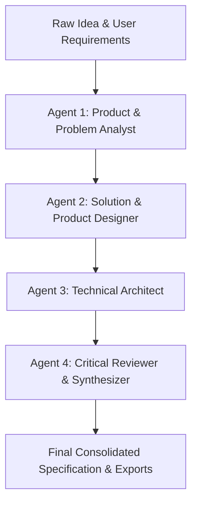

# ⚡ IdeaForge AI — Multi-Agent Application Architect

IdeaForge AI is a multi-agent Generative AI application built to transform vague, raw application ideas into structured, personalized, and technically actionable application specifications and software blueprints.

---

## 🎯 Product Overview & Value Proposition

Users often have innovative application ideas but struggle to convert them into clear, feasible, structured, and developer-ready project plans. **IdeaForge AI** solves this problem by conducting a collaborative multi-agent analysis that adapts to:
- **User Role / Experience Level** (Beginner, Student, Developer, Founder, Product Manager).
- **Primary Objective** (Idea Refinement, University Project, Hackathon MVP, Developer Specification, Production Architecture).
- **Specification Detail Level** (Basic, Intermediate, Advanced, Auto-recommended).
- **Preferred Technology Stack** (Python, React, Streamlit, FastAPI, Flutter, SQL, etc.).
- **Project Constraints** (Timeline, Team Size, Budget, Target Platforms).

---

## 🤖 Collaborative Multi-Agent Architecture

IdeaForge AI utilizes **four specialized CrewAI agents** executing in a sequential, structured pipeline:



1. **Agent 1: Product & Problem Analyst**
   - Interprets the raw idea and user constraints.
   - Formulates a precise Problem Statement, Target User Personas, User Needs, and Core Value Proposition.
   - Summarizes external web research (via Tavily API) with verified citations when research is enabled.

2. **Agent 2: Solution & Product Designer**
   - Converts the product analysis into a concrete solution concept.
   - Categorizes features using **MoSCoW Prioritization** (*Must Have, Should Have, Could Have, Future Scope*).
   - Explicitly defines **In-Scope for MVP** vs. **Out of Scope**.
   - Outlines the step-by-step User Journey and UI screens.

3. **Agent 3: Technical Architect & Requirements Engineer**
   - Engineers Functional Requirements with unique IDs (`FR-01`, `FR-02`, etc.).
   - Engineers Non-Functional Requirements (`NFR-01`, `NFR-02`, etc.) covering performance, security, and usability.
   - Recommends an optimal tech stack with explicit rationale.
   - Defines system architecture, database entities/attributes, and API contracts (`/endpoint`, method, request/response formats).

4. **Agent 4: Critical Reviewer & Specification Synthesizer**
   - Audits upstream outputs for contradictions, scope creep, and missing security or validation rules.
   - Conducts a controlled revision pass if material inconsistencies are flagged.
   - Tailors section depth strictly to the target level (**Basic**, **Intermediate**, or **Advanced**).
   - Generates immediate actionable next steps.

---

## 🛠️ Technology Stack

- **Programming Language:** Python 3.10+
- **Frontend / Application UI:** Streamlit (Custom Dark Theme & Responsive Tabs)
- **Multi-Agent Framework:** CrewAI
- **LLM Providers:** Google Gemini API (`gemini-2.0-flash`) or Groq API (`llama-3.3-70b-versatile`)
- **Data Validation & Schemas:** Pydantic v2
- **Environment Management:** `python-dotenv` & Streamlit Secrets
- **Optional Web Research:** Tavily Search API
- **Testing:** Pytest
- **Export Formats:** Markdown (`.md`) and JSON (`.json`)

---

## 📂 Project Structure

```
ideaforge-ai/
├── app.py                      # Main Streamlit web application interface
├── config.py                   # Environment & configuration loader
├── requirements.txt            # Python dependencies
├── .env.example                # Template environment variables
├── .gitignore                  # Git ignore rules
├── README.md                   # Complete project documentation
├── agents/                     # Specialized CrewAI agents
│   ├── __init__.py
│   ├── product_analyst.py      # Agent 1 implementation
│   ├── solution_designer.py    # Agent 2 implementation
│   ├── technical_architect.py  # Agent 3 implementation
│   └── critic_synthesizer.py   # Agent 4 implementation
├── workflows/                  # Sequential agent orchestration
│   ├── __init__.py
│   └── specification_workflow.py
├── models/                     # Pydantic schemas & data models
│   ├── __init__.py
│   └── schemas.py
├── services/                   # Business logic services
│   ├── __init__.py
│   ├── llm_service.py          # Gemini & Groq LLM integration
│   ├── research_service.py     # Tavily web research integration
│   └── export_service.py       # Markdown & JSON exporter
├── prompts/                    # Agent prompt templates & system instructions
│   └── agent_prompts.py
├── utils/                      # Helper utilities
│   ├── __init__.py
│   ├── validation.py           # Form validation & level recommendation
│   └── report_formatter.py     # Detail level filtering logic
└── tests/                      # Automated test suite
    ├── test_validation.py
    ├── test_schemas.py
    ├── test_workflow.py
    └── test_exports.py
```

---

## 🚀 Installation & Local Setup

### Prerequisites
- **Python 3.10 or higher** installed.
- **Git** installed.
- A **Google Gemini API Key** (from [Google AI Studio](https://aistudio.google.com/)) or a **Groq API Key** (from [Groq Console](https://console.groq.com/)).

### Step-by-Step Instructions (Windows / VS Code)

1. **Clone or Open the Repository:**
   ```bash
   git clone https://github.com/your-username/ideaforge-ai.git
   cd ideaforge-ai
   ```

2. **Create and Activate Virtual Environment:**
   ```bash
   python -m venv .venv
   # Windows PowerShell:
   .\.venv\Scripts\Activate.ps1
   # Windows Command Prompt:
   .\.venv\Scripts\activate.bat
   ```

3. **Install Dependencies:**
   ```bash
   pip install -r requirements.txt
   ```

4. **Configure Environment Variables:**
   Create a `.env` file in the root directory by copying `.env.example`:
   ```bash
   cp .env.example .env
   ```
   Edit `.env` and fill in your API key:
   ```ini
   LLM_PROVIDER=gemini
   GEMINI_API_KEY=your_actual_gemini_api_key
   GEMINI_MODEL=gemini-2.0-flash

   # Optional Groq configuration
   GROQ_API_KEY=
   GROQ_MODEL=llama-3.3-70b-versatile

   # Optional Tavily Web Search configuration
   TAVILY_API_KEY=your_actual_tavily_api_key
   ```

5. **Run the Application Locally:**
   ```bash
   streamlit run app.py
   ```
   Open your browser at `http://localhost:8501`.

---

## 🧪 Running Automated Tests

Run the test suite using `pytest` (tests include mock LLM execution for fast offline verification without consuming API credits):

```bash
pytest
```

To run a specific test module:
```bash
pytest tests/test_validation.py
pytest tests/test_workflow.py
```

---

## ☁️ Deploying to Streamlit Community Cloud

1. Push your repository to GitHub (ensure `.env` is ignored by `.gitignore`).
2. Log into [Streamlit Community Cloud](https://share.streamlit.io/) and create a new app pointing to `app.py`.
3. In the Streamlit App Settings -> **Secrets**, paste your environment configuration:
   ```toml
   LLM_PROVIDER = "gemini"
   GEMINI_API_KEY = "your_actual_gemini_api_key"
   GEMINI_MODEL = "gemini-2.0-flash"
   TAVILY_API_KEY = "your_actual_tavily_api_key"
   ```
4. Click **Deploy**.

---

## 🛡️ Security, Privacy & Reliability

- **Secret Protection:** API keys are loaded via `python-dotenv` or Streamlit Secrets. Secrets are never exposed in UI logs, reports, or file exports.
- **Input Validation:** User input is strictly sanitized and validated using Pydantic before reaching the LLM pipeline.
- **Controlled Revisions:** Multi-agent collaboration enforces a maximum 1-pass revision limit to avoid infinite loops and unnecessary API consumption.
- **Safe Fallbacks:** If external web research is disabled or keyless, the pipeline safely continues without interrupting specification generation.

---

## 📋 Features Overview vs Future Scope

| Feature Area | Current Initial Release (In Scope) | Planned Future Scope |
| --- | --- | --- |
| **User Input** | Form with dropdowns, multiselect tech stack, constraints, free-text | Multi-lingual input support |
| **Agent Pipeline** | 4 Specialized CrewAI Agents | Custom user-defined sub-agents |
| **Research** | Tavily Web Search API integration | Vector DB / Local RAG knowledge bases |
| **Export Formats** | Downloadable Markdown (`.md`) & JSON (`.json`) | Automated PDF & GitHub repo creator |
| **Detail Levels** | Basic, Intermediate, Advanced, Auto-recommended | Custom detail templates |
